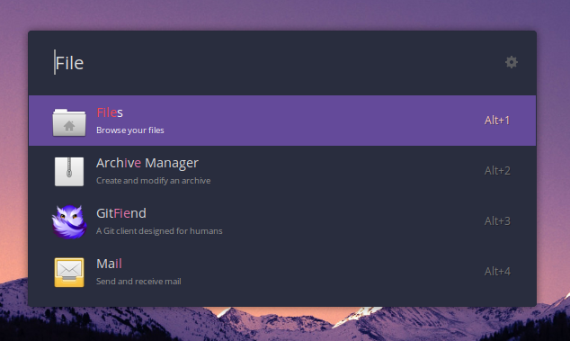

# Palenight Theme

This is a Ulauncher theme. I've tried to maintain the fidelity of the Palenight theme, for lovers of dark and vibrant colors.

## Installation

1. Download the files from this repo
2. Navigate to /home/<user>/.config/ulauncher
3. Create a folder called user-themes
4. Create another folder within user-themes called palenight
5. Copy the files from this repo to the new palenight folder
6. Change the theme with Ulauncher's preferences window

Other themes are available from here - https://gist.github.com/gornostal/02a232e6e560da7946c053555ced6cce